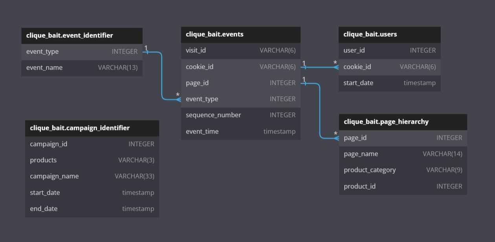

# :fishing_pole_and_fish: Case Study 6 - Clique Bait: Solution A. Entity Relationship Diagram


Using the following DDL schema details to create an ERD for all the Clique Bait datasets.

```sql
CREATE TABLE clique_bait.event_identifier (
  "event_type" INTEGER,
  "event_name" VARCHAR(13)
);

CREATE TABLE clique_bait.campaign_identifier (
  "campaign_id" INTEGER,
  "products" VARCHAR(3),
  "campaign_name" VARCHAR(33),
  "start_date" TIMESTAMP,
  "end_date" TIMESTAMP
);

CREATE TABLE clique_bait.page_hierarchy (
  "page_id" INTEGER,
  "page_name" VARCHAR(14),
  "product_category" VARCHAR(9),
  "product_id" INTEGER
);

CREATE TABLE clique_bait.users (
  "user_id" INTEGER,
  "cookie_id" VARCHAR(6),
  "start_date" TIMESTAMP
);

CREATE TABLE clique_bait.events (
  "visit_id" VARCHAR(6),
  "cookie_id" VARCHAR(6),
  "page_id" INTEGER,
  "event_type" INTEGER,
  "sequence_number" INTEGER,
  "event_time" TIMESTAMP
);
```

Entity Relationship Diagram Result from [**dbdiagram.io**](https://dbdiagram.io/d/624fcdd42514c97903f34e48).

<p align="center" width="100%">
    
</p>

---
